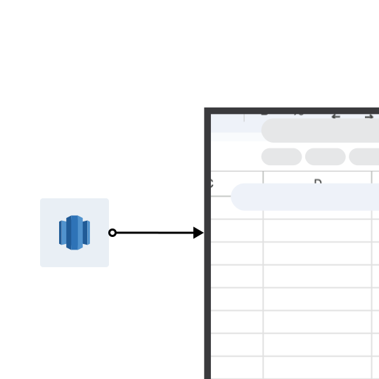
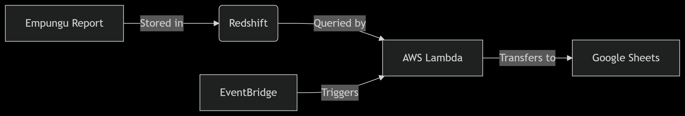

This tool enables automatic data transfer from **Amazon Redshift** to **Google Sheets** using **AWS Lambda**, with triggers managed through **Amazon EventBridge**. It is ideal for generating and sharing scheduled reports by syncing queried data from your data warehouse directly into a Google Sheet.

---

## 📌 Features

- Query data directly from Amazon Redshift  
- Push the data to a specified Google Sheet  
- Scheduled execution using EventBridge  
- Secure handling of credentials via Lambda environment variables  
- Supports Pandas DataFrame formatting and datetime conversion  

---

## 📐 Architecture




---

## ⚙️ Environment Variables

Ensure the following **Lambda environment variables** are set:

| Variable              | Description                              |
|-----------------------|------------------------------------------|
| `REDSHIFT_HOST`       | Redshift cluster endpoint (hostname)     |
| `REDSHIFT_DATABASE`   | Redshift database name                   |
| `REDSHIFT_USER`       | Redshift username                        |
| `REDSHIFT_PASSWORD`   | Redshift user password                   |
| `GOOGLE_CREDS_BASE64` | Base64-encoded Google service account credentials |

---

## 📁 Project Structure

```
.
├── lambda_function.py       # Main Lambda handler and logic
├── requirements.txt         # Python dependencies for deployment
└── README.md                # This documentation
```

---

## 📦 Dependencies

Install dependencies using:

```bash
pip install -r requirements.txt -t ./package
```

Dependencies include:

- `psycopg2-binary==2.9.9` – Redshift connectivity  
- `pandas==2.0.3` – Data formatting  
- `google-api-python-client==2.104.0` – Google Sheets API  
- `google-auth-httplib2==0.1.1`  
- `google-auth-oauthlib==1.0.0`  

---

## 🚀 Deployment Steps

1. **Package Lambda:**

```bash
mkdir package
pip install -r requirements.txt -t package/
cd package
zip -r ../function.zip .
cd ..
zip -g function.zip lambda_function.py
```

2. **Upload to AWS Lambda:**
   - Create a new function or update an existing one.
   - Set environment variables in the Lambda console.
   - Assign IAM role with access to Redshift and basic Lambda execution.

3. **Configure EventBridge:**
   - Create a rule (e.g., scheduled every hour/day).
   - Set the Lambda function as the target.

---

## 📤 Trigger Example (Event Payload)

```json
{
  "query": "SELECT * FROM sales_summary WHERE sale_date = CURRENT_DATE;",
  "spreadsheet_id": "1abcDefGHIjklmnOpQRstUvWxYZ1234567890",
  "sheet_name": "TodaySales"
}
```

---

## 📄 Output

Upon successful execution:
- The Google Sheet is updated starting from cell `A1`.
- Data includes a header row (column names) followed by result rows.

---

## 🧪 Testing

You can test the function using the AWS Lambda console:
1. Paste the sample event payload.
2. Click **Test**.
3. Check the CloudWatch logs and your target Google Sheet.

---

## 🛠 Troubleshooting

| Issue                                 | Suggestion                                                             |
|--------------------------------------|------------------------------------------------------------------------|
| `psycopg2` errors                     | Ensure Redshift networking allows Lambda access                        |
| `Invalid Credentials` or `403 error` | Check Google service account and spreadsheet sharing permissions       |
| Data not appearing in sheet          | Ensure `sheet_name` is correct and `spreadsheet_id` is accessible      |
| `No module named ...`                | Rebuild your deployment package with all dependencies correctly        |

---

## 🔐 Google Sheets Access

Make sure the service account email from your JSON credentials has **editor access** to the target spreadsheet.

---

## 📘 Notes

- All datetime columns are formatted as strings (YYYY-MM-DD HH:MM:SS) before upload.
- The script overwrites the sheet content from the top (starting at `A1`).

---

<!-- Footer section -->
<footer>
    <div class="footer-content">
        <p>Contact me:</p>
        <ul>
            <li>Email: <a href="mailto:kintujp@gmail.com">kintujp@gmail.com</a></li>
            <li>LinkedIn: <a href="https://www.linkedin.com/in/john-paul-k-aa6b8757" target="_blank" rel="noreferrer noopener">John Paul Kintu</a></li>
            <li>Portforlio: <a href="https://jpkintu.github.io/Portfolio-Resume/" target="_blank" rel="noreferrer noopener">www.jpkintu.com</a></li>
        </ul>
    </div>
</footer>

